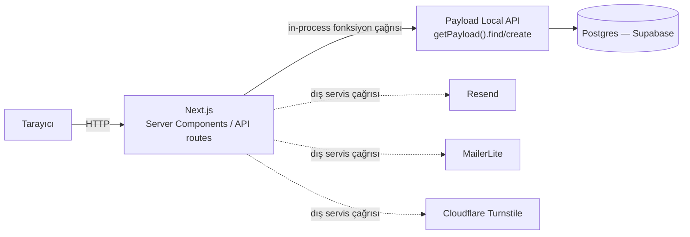

# nenenesor.com — Mimari ve Teknoloji Dokümanı

*Son güncelleme: 2026-07-01*

Bu doküman projenin teknoloji yığınını, mimarisini, proje iskeletini ve kodun mimari prensiplerini anlatır; ardından bu seçimlerin neden yapıldığını ve gerçekçi alternatiflerin neden seçilmediğini gerekçelendirir. Kalıcı, repo içi teknik referans olarak tutulur — kod değiştikçe güncellenmesi beklenir.

---

## 0. Genel Bakış

nenenesor.com, Türk anne/bebek kitlesine yönelik bir içerik platformu. İş modeli tek cümlede: **önce SEO ve editoryal içerikle (blog + uzman cevaplı Soru-Cevap) kitle oluştur, sonra affiliate link + bülten üzerinden monetize et.** MVP'de e-ticaret, sepet, ödeme yok.

Bu iş modeli mimariyi doğrudan şekillendiriyor: trafik **okuma-ağırlıklı, yazma-az** olacak (çok sayıda okuyucu, az sayıda soru gönderimi/admin işlemi), maliyet **kullanıma göre büyüyen değil öngörülebilir** olmalı (bootstrap/gelir-öncesi aşama), ve platformun asıl teknik zorluğu "içerik yayınlamak" değil, **uzman-atamalı bir Soru-Cevap iş akışını PII gizliliğiyle birlikte güvenli şekilde yürütmek.**

---

## 1. Teknoloji Yığını

| Katman | Seçim | Neden (özet — detay §5'te) |
|---|---|---|
| Framework | Next.js 15 (App Router, TS strict) | Server Components ile sıfır-hop veri okuma + olgun ISR |
| CMS | Payload CMS 3 (Next.js içine gömülü) | Sadece içerik değil, gerçek bir Node/TS backend — iş akışı+PII+rol mantığını tek yerde çözer |
| DB | PostgreSQL (Supabase, yönetilen) | Okuma-ağırlıklı trafikte öngörülebilir maliyet; ops yükü Supabase'e devredilmiş |
| Styling | Tailwind CSS 4 (`@theme`, CSS-native) | Marka renk tokenleri + hızlı derleme; `tailwind.config.ts` yerine Tailwind 4'ün önerdiği yöntem |
| Forms | React Hook Form + Zod | Form state + şema doğrulama, hem client hem server tarafında aynı şema |
| Email | Resend | Soru-cevaplandı bildirimi + bülten hoşgeldin maili |
| Captcha | Cloudflare Turnstile | `/api/soru` ve bülten formunu spam'den koruma |
| Storage | Cloudflare R2 (`@payloadcms/storage-s3`) | Medya için ucuz, S3-uyumlu depolama |
| Newsletter | MailerLite | Sadece abone toplama; haftalık gönderim MailerLite panelinden manuel |
| Paket yöneticisi | pnpm | — |

**Spesifikasyondan sapmalar (kasıtlı, sorun değil):** shadcn/ui hiç kullanılmamış (tüm 11 bileşen özel Tailwind ile yazılmış — bu boyutta bir bileşen sayısı için savunulabilir bir tercih), `next-sitemap` paketi yerine Next.js'in native `sitemap.ts`/`robots.ts` dosya kuralı kullanılmış (daha güncel yöntem).

---

## 2. Mimari

### İstek akışı



Tek Next.js süreci içinde iki mantıksal yarı var:

- **`(frontend)` route grubu** — herkese açık site. Sayfalar Server Component olarak render edilir ve veriyi `getPayload()` ile **doğrudan, HTTP'siz** çeker (aşağıya bakın).
- **`(payload)` route grubu** — Payload'ın kendi ürettiği admin paneli (`/admin`) ve genel REST/GraphQL API'si (`/api/[...slug]`, `/api/graphql`). Bu dosyalar `@payloadcms/next` paketinden gelen handler'ları olduğu gibi yeniden export eden birkaç satırlık "delegasyon" dosyaları — özel iş mantığı içermiyor.

Bunların dışında, **elle yazılmış** iki genel API rotası var: `src/app/api/soru/route.ts` ve `src/app/api/newsletter/route.ts`. Bunlar Payload'ın otomatik REST'inden bilinçli olarak ayrı tutulmuş — Zod doğrulama + Turnstile doğrulama + iş mantığı gerektiren, "bizim kontrol ettiğimiz" uçlar.

### Veri çekme deseni — kritik ayrım

Frontend sayfaları Payload'a **REST üzerinden fetch değil, aynı Node sürecinde doğrudan fonksiyon çağrısıyla** ulaşıyor:

```ts
// src/app/(frontend)/blog/[slug]/page.tsx (örnek desen)
const payload = await getPayload()
const res = await payload.find({ collection: 'posts', where: { slug: { equals: slug } } })
```

Sınır, tarayıcı ile Next.js arasında; Next.js ile Payload arasında ağ sınırı **yok**. Bu, gereksiz round-trip'leri ortadan kaldırır ve sırların (DB bağlantı dizesi vb.) hiçbir zaman istemciye sızma ihtimalini yapısal olarak kapatır.

### Tazelik stratejisi: ISR + talep-üzerine revalidation

İki katman birlikte çalışıyor:
1. **Zaman bazlı ISR** — her sayfa türü içerik oynaklığına göre ayarlanmış bir `revalidate` değeri taşıyor: `60` sn (blog, soru-cevap, ürün listeleri/detayları, anasayfa), `300` sn (uzman sayfaları — nadiren değişir), `600` sn (`/sorular/sor` — statik form), `3600` sn (sitemap).
2. **Talep-üzerine revalidation** — Posts/Questions/Products koleksiyonlarındaki `afterChange` hook'ları, bir belge `published` durumuna geçtiği anda ilgili yolları (`revalidatePath`) anında geçersiz kılıyor. Zaman bazlı katman, bu hook hiç tetiklenmezse diye bir güvenlik ağı.

---

## 3. Proje İskeleti

```
src/
├── app/
│   ├── (frontend)/                  # Herkese açık site (Server Components varsayılan)
│   │   ├── layout.tsx               # Header/Footer/fontlar, temel metadata
│   │   ├── globals.css              # Tailwind 4 @theme — marka renk tokenleri burada
│   │   ├── page.tsx                 # Anasayfa
│   │   ├── error.tsx                # Hata sınırı ('use client' — Next.js zorunluluğu)
│   │   ├── not-found.tsx            # 404
│   │   ├── blog/ …                  # Liste, detay, kategori
│   │   ├── sorular/ …               # Liste, detay, soru formu
│   │   ├── urunler/ …               # Liste, detay (affiliate)
│   │   ├── uzmanlar/ …              # Liste, profil
│   │   ├── bulten/page.tsx
│   │   └── hakkimizda/page.tsx
│   ├── (payload)/                   # Payload'ın ürettiği admin + REST/GraphQL (delegasyon)
│   │   ├── admin/[[...segments]]/
│   │   └── api/[...slug]/route.ts   # Genel Payload REST mount noktası
│   ├── api/                         # Elle yazılmış, iş mantığı içeren uçlar
│   │   ├── soru/route.ts            # POST — Turnstile + Zod + Payload create
│   │   ├── newsletter/route.ts      # POST — MailerLite + hoşgeldin maili
│   │   └── og/route.tsx             # Dinamik OG görseli (Edge runtime)
│   ├── robots.ts
│   └── sitemap.ts
├── collections/                     # Payload şeması (7 koleksiyon)
│   ├── Users.ts / Experts.ts / Categories.ts
│   ├── Posts.ts / Questions.ts / Products.ts
│   └── Media.ts
├── components/                      # 11 bileşen — 8 Server, 3 kasıtlı Client
│   ├── Header.tsx                   # 'use client' — usePathname + mobil menü state
│   ├── QuestionForm.tsx             # 'use client' — form state + Turnstile widget
│   ├── NewsletterForm.tsx           # 'use client' — form state
│   └── … (Footer, NeneNotu, ExpertBadge/Card, PostCard, QuestionCard,
│          AffiliateButton, AffiliateDisclosure — hepsi Server Component)
├── lib/
│   ├── payload.ts        # getPayload() singleton
│   ├── seo.ts             # JSON-LD üreticileri (Article, Person, QAPage, ItemList)
│   ├── resend.ts          # E-posta şablonları + mock-mode
│   ├── mailerlite.ts      # Bülten abonelik API'si + mock-mode
│   ├── turnstile.ts       # Sunucu tarafı captcha doğrulama + mock-mode
│   ├── slug.ts             # Türkçe karakter dönüşümü + otomatik slug hook'u
│   ├── lexical.ts         # Seed verisi için Lexical doküman üreticileri
│   ├── seed.ts             # İlk veri: 6 kategori, 3 uzman, 3 örnek yazı
│   └── utils.ts            # cn(), site sabitleri
└── payload.config.ts       # Payload yapılandırması — DB adaptörü, koleksiyonlar, seed hook'u
```

**Not edilmesi gereken sapmalar:** `public/` dizini henüz yok (OG görseli statik dosya yerine `/api/og` ile dinamik üretiliyor — kasıtlı). Footer `/kvkk` ve `/gizlilik`'e link veriyor ama bu sayfalar henüz yazılmamış (bkz. §6). Test runner, Docker, CI hiçbir yerde yok.

---

## 4. Kodun Mimari Prensipleri

Önem sırasına göre, her biri kod tabanındaki somut kanıtla:

### 1) Erişim kontrolü sorgu katmanına itilmiş — **en yük taşıyan karar**

Payload'da `access` fonksiyonları boolean yerine bir **sorgu kısıtı nesnesi** döndürebiliyor ve bu, Payload tarafından doğrudan SQL `WHERE`'e çevriliyor. `Questions.ts`'te bir `expert` rolü için `readAccess`/`updateAccess`, `{ assignedExpert: { equals: linkedExpertId } }` döndürüyor — yani bir uzmanın kendi `payload.find()` çağrısı, başka bir uzmanın soru kuyruğunu **görme imkânına bile sahip değil**, uygulama mantığıyla engellenmiş değil. Posts/Products aynı deseni daha dar uygular (`{ status: { equals: 'published' } }`, anonim okuyucular için).

Bunun üzerine, **alan-seviyesi** ikinci ve bağımsız bir katman var: `askerEmail` alanının `access.read`'i sadece admin/editor için `true` dönüyor (düz boolean, satır kısıtından farklı bir eksen). Koleksiyon erişimi hangi *satırların*, alan erişimi o satırların hangi *alanlarının* döneceğini kontrol ediyor — ikisi de gerekli, çünkü Payload'ın genel REST mount'u (`/api/[...slug]`) koleksiyon kontrolünden geçen her satırın her alanını serileştirir.

### 2) Yan etkiler hook'larda yaşar, handler'larda değil

Posts/Questions/Products'ta `afterChange` hook'u, bir belge `published` durumuna geçtiğinde iki şeyi yapar: `revalidatePath()` çağırır ve (Questions için) Resend ile bildirim maili gönderir. Üç hook dosyası da aynı `req?.context?.skipRevalidate` kaçış kapısını paylaşıyor — `seed.ts` bunu her seed belgesinde `context: { skipRevalidate: true }` ile tetikliyor. Bu, hook sözleşmesinin baştan iki farklı çağrı kaynağını (HTTP isteği/admin düzenlemesi VE seed script'inin local API çağrısı) güvenle destekleyecek şekilde tasarlandığının kanıtı — sonradan yamanmış değil.

### 3) Gömülü tek backend, sıfır-hop okuma

`/api/soru` ve `/api/newsletter` sınırı net gösteriyor: tarayıcıdan gelen HTTP isteği Next.js'e ulaşır, ama Next.js'ten Payload'a geçiş **local Node API çağrısı** (`payload.create(...)`) — ikinci bir dahili HTTP isteği yok. Aynı desen Server Component okumaları için de geçerli. Sınır sadece tarayıcı↔Next.js arasında; Next.js↔Payload tamamen süreç-içi.

### 4) Sunucu-öncelikli render

Uygulamada 4 `'use client'` dosyası var: `Header.tsx`, `QuestionForm.tsx`, `NewsletterForm.tsx` — üçü de gerçek etkileşim gerektirdiği için (state, form, Turnstile widget) — artı `error.tsx`, ki bu Next.js'in hata sınırlarını Client Component olmaya **zorlaması** yüzünden (React error boundary'lerin ihtiyaç duyduğu lifecycle, Server Component'lerde yok). Yani: 3 gerekçeli tercih + 1 framework zorunluluğu. Geri kalan her şey Server Component.

### 5) ISR + talep-üzerine revalidation: katmanlı tazelik stratejisi

§2'de anlatılan iki katman (zaman bazlı + hook tetiklemeli) — ayrıca `revalidate` değerlerinin kendisi de kasıtlı: form sayfası (600sn) > uzman profilleri (300sn) > içerik listeleri (60sn). Bu kademeleme, içerik oynaklığına göre bilinçli bir tercih, birbirinin yerine geçebilir rastgele sayılar değil.

### 6) Dış servis entegrasyonlarında risk-katmanlı hata davranışı

Üç entegrasyon (`resend.ts`, `mailerlite.ts`, `turnstile.ts`) API anahtarı eksik/mock olduğunda farklı ama **kasıtlı** davranıyor — hepsi aynı şekilde değil:
- **Turnstile ve MailerLite** ("gelen akışı kapatan" entegrasyonlar): dev'de sessizce geç, **prod'da anahtar yoksa sert başarısız ol** (`turnstile_not_configured` / `newsletter_not_configured`) — çünkü bunlar kullanıcı akışını (form gönderimi, abonelik) engelliyor.
- **Resend** ("giden bildirim" entegrasyonu): anahtar olmasa da **her ortamda** sessizce log'layıp geçiyor, prod'da bile sert başarısızlık yolu yok — çünkü en kötü ihtimalle bir uzmanın cevabı bildirim maili tetiklemez, bu yumuşak bir hata, akışı bloklamamalı.

Bu asimetri kazara değil; blast-radius'a göre kademelenmiş bir risk modeli.

### 7) Şema, tipler için tek doğruluk kaynağı

`payload-types.ts`, koleksiyon config'lerinden `payload generate:types` ile üretiliyor, dosyanın başında "ELLE DEĞİŞTİRME" notu var. API rotaları ve lib fonksiyonları bunu import ediyor. En az yük taşıyan prensip bu — sistem davranışını değil, geliştirici iş akışını şekillendiriyor (üretilmiş bir tip dosyasını elle "düzeltme" hatasını önlüyor).

### 8) Kimlik doğrulama şu an "güvenilir altyapı," henüz savunulan bir sınır değil

`Users.ts` doğru tasarlanmış (`create`/`update`/`delete` sadece `admin` rolüne açık — prensip 1 ile tutarlı). Ama 2026-07-01'de HEAD commit'i (`23c22e2`), kimlik doğrulamasız bir `GET` ile `admin@nenenesor.com` / `adminpassword123` kimlik bilgileriyle admin hesabı oluşturan ve şifreyi düz metin döndüren bir endpoint eklemişti — `NODE_ENV` kontrolü yok, hiçbir yerden korunmuyor. Bu, prensip 1'i baltalayan bir istisna: "erişim kontrolü sorgu katmanına itilmiş" iddiası sadece Payload'ın erişim-kontrollü yüzeyinden geçen istekler için doğru, bu endpoint o yüzeyi tamamen atlıyordu (`payload.create` çağrısında hiçbir `user` kontrolü yok). Aynı gün düzeltildi (dosya silindi, bkz. §6).

---

## 5. Neden Bu Yığın, Neden Alternatifler Değil

nenenesor.com "sadece bir blog" değil — veri modeli gerçek bir **iş akışı** taşıyor: Soru-Cevap'ta 5 durumlu bir akış (`pending → assigned → answered → published → rejected`), herkese açık ama Turnstile korumalı yazma, hem satır-bazlı hem alan-bazlı rol kontrolü, yayınlanma anında e-posta tetikleyen bir hook, affiliate linkleri için iç içe dizi alanları. Bu kombinasyon klasik bir "içerik modelleme" problemi değil — bir **backend** problemi. Bu çerçeve, alternatif değerlendirmesinin tamamını belirliyor.

**Ghost / vanilla WordPress neden kaybediyor:** Bu platformlar post/tag/author modelinin ötesine geçemiyor. Soru-Cevap akışını oturtmak için ikinci, elle yazılmış bir backend (kendi auth'u, kendi tabloları, kendi hook'ları) inşa edip üzerine yapıştırmak gerekir — bu basitleştirme değil, **iki sistemi birbirine lehimlemek**, şu anki tek-sistem çözümünden daha kötü. Vanilla WordPress'te bunu ACF + elle yazılmış PHP capability check'leriyle yapmak hem daha fazla kod hem daha geniş saldırı yüzeyi (WP eklenti ekosistemi küçük site ele geçirmelerinin başlıca nedeni) hem de Payload'ın ücretsiz sağladığı tip güvenliğinden yoksun.

**Sanity / Strapi + Next.js neden kaybediyor:** Bunlar "içerik API'si," tam backend değil. Asıl zor problem (iş akışı + PII + rol-bazlı erişim) bu araçlarla da çözülmüyor — yine ayrı bir backend/webhook katmanı gerekir, iki sistem sorunu burada da tekrarlanır. Payload'ın farkı "daha iyi editör" değil (Sanity Studio editör deneyimi olarak muhtemelen daha iyidir) — Payload'ın aynı Next.js sürecine gömülü, hook'ları ve ORM'i olan gerçek bir Node/TS backend olması.

**Astro + headless CMS neden "marjinal, taşımaya değmez":** Astro'nun teorik avantajı (daha az client-side JS → daha iyi Core Web Vitals) bu kod tabanında zaten büyük ölçüde bankaya yatırılmış — proje disiplinli şekilde Server Components kullanıyor (§4.4). Astro'ya geçiş, zaten kazanılmış bir faydayı tekrar kazanmak için gerçek entegrasyon riski (Payload-Astro entegrasyonu Payload-Next kadar olgun değil) almak demek.

**WordPress'in Türkiye'deki geniş geliştirici/editör havuzu bile bu kararı değiştirmiyor:** Bu havuzun genişliği sadece "içerik" yarısına yardım ediyor; Soru-Cevap iş akışı yine özel geliştirme gerektiriyor — projenin en riskli kısmını ucuzlatmıyor.

**Maliyet/ops çerçevesi:** Trafik profili okuma-ağırlıklı, yazma-az — ISR sayesinde çoğu sayfa görüntülemesi veritabanına hiç dokunmuyor. Bu profil tam olarak SaaS headless CMS'lerin (Sanity/Strapi Cloud) fiyatlandırmasının en agresif olduğu yer: istek/bant genişliği bazlı ücretlendirme, büyütmeye çalıştığınız "okuyucu sayısı" metriğiyle birebir ölçekleniyor — yapısal bir uyumsuzluk. Postgres zaten Supabase üzerinde **yönetilen** bir örnek (self-hosted DB ops yükü değil), bu da mevcut yığının maliyet/ops dengesini daha da olumlu kılıyor.

| Seçenek | Güçlü yönü | Neden seçilmedi/seçilmemeli |
|---|---|---|
| WordPress (headless) | Türkiye'de geniş/ucuz geliştirici-editör havuzu, olgun SEO eklenti ekosistemi | Havuz sadece "içerik" yarısına yardım eder; iş akışı yine özel geliştirme ister |
| Sanity / Strapi + Next.js | Daha güçlü içerik modelleme UX'i, daha az self-host ops yükü | İçerik-API'si, tam backend değil; kullanım-bazlı fiyatlandırma büyüme metriğiyle ölçekleniyor |
| Astro + Payload/headless CMS | Teorik olarak daha az client JS | Kazanım zaten mevcut RSC disipliniyle bankaya yatırılmış |
| **Next.js + Payload + Postgres (mevcut)** | Tek backend, sorgu-seviyesinde rol/satır erişimi, PII+workflow+içerik aynı sistemde, öngörülebilir maliyet | — (önerilen) |

---

## 6. Bilinen Boşluklar / Henüz Yapılmayanlar

- **`/kvkk` ve `/gizlilik`** footer'dan link veriliyor ama sayfalar yazılmamış.
- **Test runner, Docker, CI/CD yok.** Kod tabanı hâlâ küçükken eklemesi ucuz; en azından `pnpm build`'i her PR'da çalıştıran bir CI adımı, geçmişte yaşanan bir build-kıran hatayı otomatik yakalardı.
- **DigitalOcean App Platform** spesifikasyonda deploy hedefi olarak adı geçiyor ama hiç uygulanmamış (Dockerfile/`app.yaml` yok).
- **2026-07-01 tarihli güvenlik düzeltmesi:** `create-admin` endpoint'i (kimlik doğrulamasız admin oluşturma, düz metin şifre sızıntısı) silindi; `askerEmail`'e alan-seviyesi erişim kontrolü eklendi; `payload.config.ts`'e prod-güvenli migration ayarı (`push`/`migrationDir`) eklendi. Bu üç düzeltme `pnpm lint`/`pnpm build` ile doğrulandı.

---

## Kaynak Dosyalar

- `src/collections/Questions.ts` — prensip 1 ve 2 için ana kanıt (satır+alan erişimi, hook deseni)
- `src/collections/Posts.ts`, `Products.ts` — aynı erişim/hook desenlerinin tekrarı
- `src/lib/resend.ts`, `mailerlite.ts`, `turnstile.ts` — risk-katmanlı mock-mode kanıtı
- `src/lib/seed.ts` — `skipRevalidate` hook-güvenliği kanıtı
- `src/payload.config.ts` — migration/push ayarı
